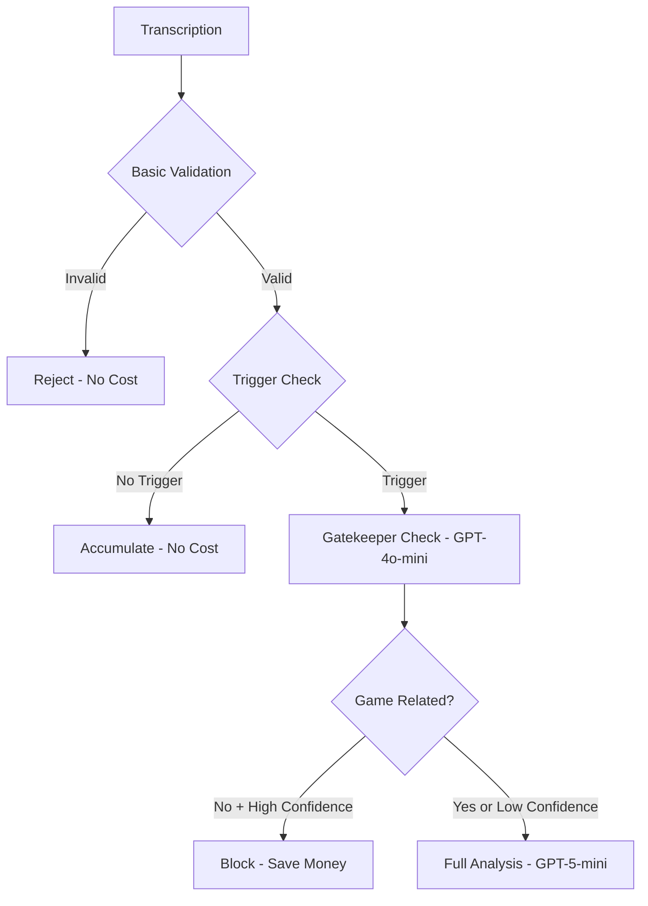

# Gatekeeper Validation System

**Last Updated:** 2025-10-09  
**Status:** Complete

## Overview

The Gatekeeper Validation System is a cost-optimization layer that uses GPT-5-mini to quickly filter out non-game-related transcriptions before they reach the expensive full GPT-5-mini analysis with the large system prompt.

This system provides **50-70% cost savings** by blocking casual conversation while allowing all game-related speech through.

## Table of Contents

- [Overview](#overview)
- [Architecture](#architecture)
- [How It Works](#how-it-works)
- [Configuration](#configuration)
- [What Gets Blocked vs Allowed](#what-gets-blocked-vs-allowed)
- [Implementation Details](#implementation-details)
- [Monitoring & Observability](#monitoring--observability)
- [Performance Metrics](#performance-metrics)
- [Tuning Recommendations](#tuning-recommendations)
- [Future Enhancements](#future-enhancements)
- [Troubleshooting](#troubleshooting)
- [Code References](#code-references)
- [Related Documentation](#related-documentation)

## Architecture

### Validation Pipeline Layers

The system uses a multi-layered validation approach:

```
1. Basic Validation (Pattern-based)
   ├─ Empty/whitespace check
   ├─ Length validation
   ├─ Noise pattern detection
   └─ Whisper hallucination detection
   
2. Trigger System (Content-aware)
   ├─ Priority keywords
   ├─ Action completion phrases
   ├─ Silence detection
   ├─ Word count thresholds
   └─ Time-based triggers
   
3. Gatekeeper (LLM-based) ← NEW
   ├─ GPT-4o-mini quick check
   ├─ Game relevance classification
   └─ Confidence scoring
   
4. Full Analysis (Expensive)
   └─ GPT-5-mini with full system prompt
```

## How It Works

### When Gatekeeper Activates

The gatekeeper only runs when:
1. Basic validation passes (not noise/silence)
2. Trigger system determines analysis should occur
3. **Before** the expensive full GPT-5-mini analysis

This ensures we only spend money on the gatekeeper when we're about to spend more money on full analysis.

### Gatekeeper Decision Flow



### Cost Analysis

**Without Gatekeeper:**
- Casual conversation → Full analysis → ~$0.015-0.03 per call

**With Gatekeeper:**
- Game-related → Gatekeeper ($0.0001) + Full analysis ($0.015-0.03)
- Casual conversation → Gatekeeper ($0.0001) → Blocked ✅

**Savings:** ~99% cost reduction on filtered conversations

## Configuration

### Confidence Threshold

Located in `app/api/analyze/route.ts`:

```typescript
const GATEKEEPER_CONFIDENCE_THRESHOLD = 0.7;
```

- **Higher (0.8-0.9)**: More conservative, blocks only when very confident
- **Lower (0.5-0.7)**: More aggressive, blocks more conversations
- **Current (0.7)**: Balanced approach

### Fail-Open Design

If the gatekeeper fails (API error, timeout), it defaults to **allowing** the transcription through. This prevents blocking legitimate game content if the gatekeeper has issues.

```typescript
// On error, default to allowing
return {
  isGameRelated: true,
  reason: 'Gatekeeper check failed, allowing through',
  confidence: 0.5
};
```

## What Gets Blocked vs Allowed

### ✅ ALLOWED (Game-Related)

```
Examples:
- "Moving to shooting phase"
- "My Terminators lost 2 models"
- "How many CP do I have?"
- "Opponent's Dreadnought took 6 wounds"
- "I'm using Transhuman Physiology"
- "That hits on 4s right?"
- "Rolling for damage, got 3 wounds"
```

### ❌ BLOCKED (Not Game-Related)

```
Examples:
- "Hey man, how's it going?"
- "Want to grab pizza after?"
- "Did you see that movie last night?"
- "Thanks" (without context)
- "Okay" (single word)
- "The weather is crazy today"
- "Hold on, let me check my phone"
```

### 🤔 CONTEXT-DEPENDENT

The gatekeeper considers recent conversation history:

```
Context: ["Moving to shooting phase", "Targeting your Dreadnought"]
Current: "Okay" → ALLOWED (game context)

Context: None or casual chat
Current: "Okay" → BLOCKED (no game context)
```

## Implementation Details

### Function: `validateGameRelevance()`

Location: `lib/audioValidation.ts`

```typescript
export async function validateGameRelevance(
  transcription: string,
  conversationContext?: string[]
): Promise<GatekeeperValidationResult>
```

**Parameters:**
- `transcription`: Current transcription text
- `conversationContext`: Last 5 transcriptions for context (optional)

**Returns:**
```typescript
{
  isGameRelated: boolean,     // True if game-related
  reason: string,              // Explanation
  confidence: number           // 0-1 scale
}
```

### GPT-4o-mini Configuration

```typescript
{
  model: 'gpt-4o-mini',
  temperature: 0.3,              // Low for consistency
  max_tokens: 150,               // Keep response short
  response_format: { type: 'json_object' }
}
```

## Monitoring & Observability

### Langfuse Tracing

All gatekeeper checks are traced in Langfuse:

```typescript
const gatekeeperSpan = trace.span({
  name: "gatekeeper-validation",
  metadata: {
    transcriptionLength: transcribedText.length,
    contextLength: transcriptsSinceLastAnalysis.length
  }
});
```

**Trace Tags:**
- `gatekeeper-approved` - Full analysis proceeded
- `gatekeeper-blocked` - Analysis was blocked (not in trace, blocked before)

### Console Logging

```
🚦 Gatekeeper check: ALLOWED (0.85 confidence) - Contains game mechanics discussion
📝 Gatekeeper blocked analysis - not game-related
✅ Gatekeeper approved - proceeding with full analysis
```

## Performance Metrics

### Expected Results

- **Accuracy**: ~90-95% correct classification
- **Latency**: ~200-500ms (GPT-4o-mini is fast)
- **Cost per check**: ~$0.0001 (150 tokens)
- **Savings**: 50-70% reduction in full analysis calls

### Monitoring Queries

In Langfuse, track:
1. Gatekeeper approval rate
2. False positives (blocked game content)
3. False negatives (allowed casual chat)
4. Average confidence scores

## Tuning Recommendations

### If Too Many False Positives (Blocking Game Content)

1. **Lower confidence threshold**: 0.7 → 0.6
2. **Increase context**: Pass more conversation history
3. **Update gatekeeper prompt**: Add more game-related examples

### If Too Many False Negatives (Allowing Casual Chat)

1. **Raise confidence threshold**: 0.7 → 0.8
2. **Strengthen NOT GAME-RELATED examples in prompt**
3. **Add additional validation rules** in basic validation

### If Latency Issues

1. **Reduce max_tokens**: 150 → 100
2. **Consider caching** for repeated phrases
3. **Batch multiple transcriptions** (advanced)

## Future Enhancements

### Phase 2: Caching
- Cache common phrases ("how many CP?", "moving to shooting")
- Skip LLM call for exact matches
- ~90% cost reduction on repeated queries

### Phase 3: Local Model
- Use local small model (BERT, DistilBERT)
- ~99% cost reduction
- <50ms latency

### Phase 4: Learning System
- Track user overrides (if they manually force analysis)
- Fine-tune gatekeeper based on corrections
- Improve accuracy over time

## Troubleshooting

### Gatekeeper Always Passes

**Symptom:** All transcriptions get through, no blocking

**Causes:**
1. API errors causing fail-open behavior
2. Confidence threshold too high
3. Prompt too permissive

**Solution:**
- Check logs for gatekeeper errors
- Review confidence scores in Langfuse
- Adjust `GATEKEEPER_CONFIDENCE_THRESHOLD`

### Gatekeeper Blocking Game Content

**Symptom:** Legitimate game transcriptions blocked

**Causes:**
1. Confidence threshold too low
2. Missing context
3. Prompt too restrictive

**Solution:**
- Increase threshold to 0.8
- Pass more conversation context
- Update GAME-RELATED examples in prompt

### High Latency

**Symptom:** Analysis feels slow

**Causes:**
1. GPT-4o-mini API latency
2. Network issues
3. Concurrent request limits

**Solution:**
- Check OpenAI API status
- Reduce max_tokens
- Consider caching layer

## Code References

- **Gatekeeper Function**: `lib/audioValidation.ts:283-371`
- **Integration Point**: `app/api/analyze/route.ts:268-310`
- **Trigger System**: `lib/analysisTriggers.ts`
- **Basic Validation**: `lib/audioValidation.ts:143-229`

## Related Documentation

- **[Context System Guide](../guides/CONTEXT_SYSTEM_GUIDE.md)** - Analysis trigger system that feeds the gatekeeper
- **[Validation System Guide](../guides/VALIDATION_GUIDE.md)** - Game rule validation (separate from gatekeeper)
- **[Analyze API Endpoint](../api/ANALYZE_ENDPOINT.md)** - Full API documentation
- **[Langfuse Observability](./LANGFUSE_OBSERVABILITY.md)** - Monitoring gatekeeper decisions
- **[CHANGELOG](../../CHANGELOG.md)** - Version 2.9.0 release notes

