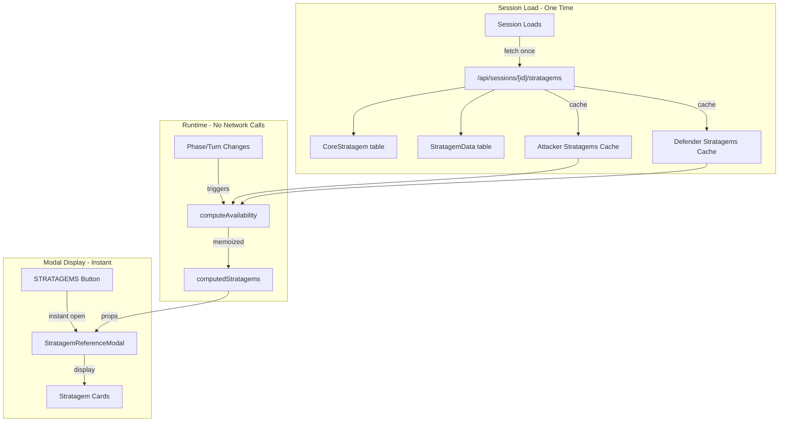

# Stratagem Quick Reference

**Last Updated:** 2025-12-20
**Status:** Complete

## Overview

The Stratagem Quick Reference feature provides instant access to available stratagems during gameplay. A button in each player's panel opens a modal displaying all Core and Faction stratagems, filtered by the current game phase and the player's selected detachment. This allows players to quickly check what stratagems are available without interrupting the game flow.

Stratagems are pre-fetched when the session loads, so the modal opens instantly with no loading state. Phase and turn changes re-compute availability client-side without additional network requests.

Both attacker and defender armies are fully linked to game sessions, enabling accurate detachment-specific stratagem filtering for both players.

## Table of Contents

- [Features](#features)
- [User Interface](#user-interface)
- [Phase Filtering](#phase-filtering)
- [Stratagem Display](#stratagem-display)
- [Technical Architecture](#technical-architecture)
- [Related Documentation](#related-documentation)

## Features

- **Instant Modal Opening**: Stratagems pre-fetched on session load - no loading state when opening modal
- **Client-Side Filtering**: Phase/turn changes re-compute availability without API calls
- **Phase-Aware Filtering**: Stratagems automatically filtered based on current game phase (Command, Movement, Shooting, Charge, Fight)
- **Reactive Stratagem Handling**: Stratagems usable during opponent's turn are properly highlighted
- **Core + Faction Stratagems**: Shows universal Core stratagems plus army-specific faction/detachment stratagems
- **CP Affordability**: Visual indicators show which stratagems the player can afford
- **Expandable Details**: Each stratagem card expands to show full rules (when, target, effect)
- **Quick Filter Toggle**: "Show only available" checkbox (checked by default) to hide unavailable stratagems

## User Interface

### Accessing the Modal

Each player panel (Defender/Attacker) has a **STRATAGEMS** button below the secondary objectives:

```
┌──────────────────────────────────┐
│ DEFENDER                         │
│ andrew                           │
│ SPACE MARINES                    │
├──────────────────────────────────┤
│ ⚡ CP: 3     │  🎯 VP: 0        │
├──────────────────────────────────┤
│ [Secondary 1]  [Secondary 2]     │
├──────────────────────────────────┤
│     ◆ STRATAGEMS                 │  ← Click to open
└──────────────────────────────────┘
```

### Modal Layout

The modal displays stratagems in two sections:

1. **Core Stratagems** - Universal stratagems available to all armies
2. **Faction Stratagems** - Stratagems specific to the player's faction/detachment

Each stratagem card shows:
- **CP Cost Badge** - Large colored badge (orange for available, gray for unavailable)
- **Name** - Stratagem name with REACTIVE badge if applicable
- **Type & Phases** - Category and which phases it can be used in
- **Expandable Details** - When, Target, and Effect text

### Visual States

| State | Appearance |
|-------|------------|
| Available & Affordable | Full opacity, colored CP badge |
| Available but Insufficient CP | Full opacity with "INSUFFICIENT CP" badge |
| Not Available (wrong phase) | 60% opacity, gray styling |
| Reactive (opponent's turn) | REACTIVE badge, available when opponent's turn |

## Phase Filtering

Stratagems have a `triggerPhase` field that determines when they can be used:

- **Phase-Specific**: `["Shooting"]`, `["Fight"]`, `["Charge"]`
- **Multi-Phase**: `["Movement", "Charge"]`
- **Any Phase**: `["Any"]` - Always available

### Reactive Stratagems

Stratagems marked as `isReactive: true` are available during the opponent's turn:
- **Overwatch** - Shooting phase (opponent's turn)
- **Counter-offensive** - Fight phase (opponent's turn)
- **Fire Overwatch** - When opponent charges

## Stratagem Display

### Collapsed View (Default)

```
┌─────┬──────────────────────────────────────┬───┐
│ 1CP │ ARMOUR OF CONTEMPT                   │ ▼ │
│     │ Battle Tactic • Any                  │   │
└─────┴──────────────────────────────────────┴───┘
```

### Expanded View (Click to Expand)

```
┌─────┬──────────────────────────────────────┬───┐
│ 2CP │ OVERWATCH                    REACTIVE│ ▲ │
│     │ Strategic Ploy • Shooting            │   │
├─────┴──────────────────────────────────────┴───┤
│ WHEN:                                          │
│ Your opponent's Movement or Charge phase,      │
│ just after an enemy unit ends a move.          │
├────────────────────────────────────────────────┤
│ TARGET:                                        │
│ One unit from your army that is within 24"     │
│ of that enemy unit and would be eligible to    │
│ shoot.                                         │
├────────────────────────────────────────────────┤
│ EFFECT:                                        │
│ Your unit can shoot that enemy unit as if      │
│ it were your Shooting phase, but the hit       │
│ roll is unmodified and always requires a 6.    │
└────────────────────────────────────────────────┘
```

## Technical Architecture

### Data Flow (Pre-fetch Architecture)



### Pre-fetch vs On-Demand

| Aspect | Before (On-Demand) | After (Pre-fetch) |
|--------|-------------------|-------------------|
| Modal Open | API call + loading spinner | Instant display |
| Phase Change | New API call | Client-side filter |
| Turn Change | New API call | Client-side filter |
| Data Freshness | Always fresh | Cached at session load |
| Network Requests | Every modal open | Once per session |

### Army Linking

Both attacker and defender armies are linked to the session:

| Player | Session Field | Data Access |
|--------|---------------|-------------|
| Attacker | `attackerArmyId` → `attackerArmy` | Faction, detachment, units |
| Defender | `defenderArmyId` → `defenderArmy` | Faction, detachment, units |

This enables accurate detachment-specific stratagem filtering for both players.

### API Endpoint

`GET /api/sessions/[id]/stratagems?phase=X&turn=Y&player=Z`

Returns:
- Core stratagems from `CoreStratagem` table (11 universal stratagems)
- Faction stratagems from `StratagemData` table (filtered by army faction AND detachment)
- Availability status for each stratagem based on phase and turn
- Deduplication when no detachment specified

### Component Structure

- **GameStateDisplay** - Contains the STRATAGEMS buttons and pre-fetching logic
  - Pre-fetches stratagems on session load
  - Stores `attackerStratagems` and `defenderStratagems` cache
  - Computes `computedStratagems` with availability based on current phase/turn
  - Passes pre-computed data to modal as props
  
- **StratagemReferenceModal** - Modal display (no data fetching)
  - Receives `coreStratagems` and `factionStratagems` as props
  - Handles "Show only available" toggle (defaults to checked)
  - No loading state - data always available
  
- **StratagemCard** - Individual expandable card component (inline)

## Related Documentation

- **[Session Stratagems Endpoint](../api/SESSION_STRATAGEMS_ENDPOINT.md)** - API reference for `/api/sessions/[id]/stratagems`
- **[Stratagem Tracking System](STRATAGEM_TRACKING.md)** - How stratagems are logged during gameplay
- **[Stratagem & Detachment System](STRATAGEM_DETACHMENT_SYSTEM.md)** - Detachment-based stratagem filtering
- **[Manual UI Controls](MANUAL_UI_CONTROLS.md)** - Other manual controls for game actions

